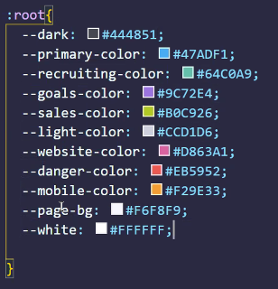

# passaggi di coorezione
- portiamo il progetto su figma
- creiamo una palette colori

## andiamo su vsc (html)
- incomiciamo a creare la struttura html5 
- creiamo header-main-footer
- creiamo il css e linkiamolo
- nell'header creiamo un div "site_logo"
- ins. un tag img e mettiamo il logo
- ins. titolo dandogli una classe "logo_title"

/* fine header */ 

- passiamo al main e creiamo un div "action" e ci inseriamo i due button

/* fine action */

-creiamo un div "new-task" dove metteremo un h2 con all'interno uno span (identity code) e scriviamo new task

/*fine new_task*/

-sreiamo una lista non ordinata e diamogli una classi "stle_none"
-all'interno mettiamo del li con tre span, uno per indicare il simbolo di check/uncheck ("icon_check")("icon_uncheck") uno per il nome della task ("name_task") e uno per il tag("badge bedge_tipo di badge(editorial-Q1 Goals-....)) 

## creiamo un css
- inizializiamo la pagina "margin:0"
- creiamoci la root con la palette colori 

- usamo il comando vertical-align (per fare questo impostiamo una altezza al padre e un vertical-align al figlio)
- per renderlo più bello lo abbiamo accentrato

/* fine header */

- creiamo il main, gli impostiamo una dimensione e un margine, gli mettiamo un piccolo radius al contenitore e gli diamo un background
- disabilitiamo i bordi e mettiamo transparent al background, inseriamo un padding
- mettiamo un border-bottom nel div contenitore "action" e un padding-bottom

/* fine action */

- diamo un un display: inline-block 

/* fine new_task*/

- diamo un bordo al "check/uncheck" e un radius del 100% solid e un border-color
- alla classe badge diamo gli attributi comuni tra i vari badge quindi: border-radius e padding
- per ogni specifico badge_tipo_di_badge modifichiamo colore e background-color

## bonus

### html
- creo il link al un secondo foglio css

### css
- copio il css appena creato e creo un secondo foglio css (che abbiamo precedentemento linkato all'html)
- modifico la sezione root { e modifico le variabili}